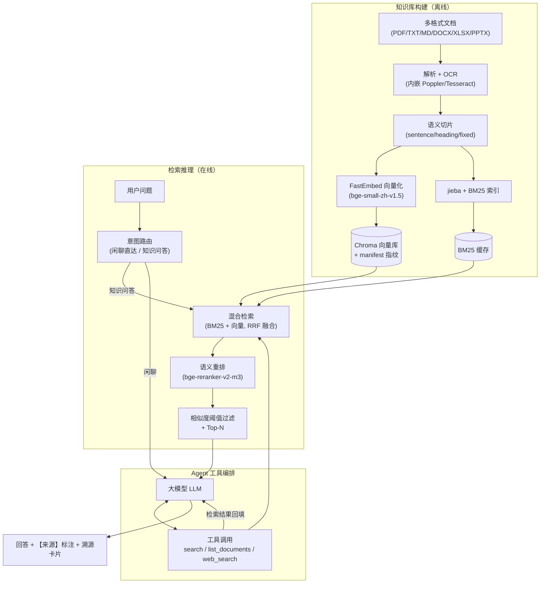

<h1 align="center">🧭 LocalRAG · 可定制本地 RAG 智能体</h1>

<div align="center">
  <p><em>本地优先的私有知识库问答系统 · 检索可溯源、数据不出本地</em></p>
  <p>
    
    
    
    
    
    
    
  </p>
</div>

---

> 🔗 **项目仓库**：[https://github.com/kangxiaobai-kzj/LocalRAG](https://github.com/kangxiaobai-kzj/LocalRAG)

## 📑 目录

- [🌟 项目定位与技术亮点](#-项目定位与技术亮点)
- [🧠 核心技术栈](#-核心技术栈)
- [🏗️ 系统架构](#️-系统架构)
- [🔧 关键工程实现](#-关键工程实现)
- [✨ 功能一览](#-功能一览)
- [🚀 快速开始](#-快速开始)
- [⚙️ 配置说明](#️-配置说明)
- [📂 项目结构](#-项目结构)
- [🧪 测试与评测](#-测试与评测)
- [🗺️ 路线图](#️-路线图)
- [❓ 常见问题](#-常见问题)
- [📄 License](#-license)

---

## 🌟 项目定位与技术亮点

这是一套 **Agentic RAG（智能检索增强生成）** 的完整工程实现，覆盖「文档解析 → 切片 → 向量化 → 混合检索 → 语义重排 → Agent 工具编排 → 带溯源回答」的全链路，可作为本地私有知识库问答系统的工程参考：

### 核心概念速览

| 技术 | 在本项目中的角色 | 说明 |
| :--- | :--- | :--- |
| **RAG** | 检索增强生成 | 先检索私有知识库，再让大模型基于检索片段作答，回答带【来源：文件名】标注与原文溯源卡片，抑制幻觉 |
| **Agent（智能体）** | 意图路由 + 工具编排 | 轻量意图初判分流「闲聊直达 / 知识问答」；Agent 可多轮自主调用工具（检索 / 列文档 / 联网搜索），直到得到可作答的上下文 |
| **MCP** | 双角色实践 | **服务端**：本项目以 `mcp_server.py` 对外暴露 `search_knowledge_base` / `list_documents` 工具，可被任意 MCP 客户端调用；**执行端**：Agent 内部以 LangChain tool-calling 驱动同一套工具，`MCP_TOOL_BACKEND` 支持 direct / MCP 双模式切换 |
| **混合检索** | BM25 + 向量双路召回 | 关键词（jieba 分词 + BM25Okapi）与语义（FastEmbed 向量）互补，RRF 倒数排名融合，兼顾召回率与相关性 |
| **语义重排** | bge-reranker-v2-m3 | 交叉编码器对初步召回精排，把最相关的片段排到最前（相关性可配置阈值过滤） |
| **增量构建** | manifest 指纹 | 仅对新增/变更/删除的文件重建索引，BM25 缓存本地持久化，二次启动毫秒级加载 |
| **多格式解析** | PDF/TXT/MD/DOCX/XLSX/PPTX + OCR | 内嵌 Poppler + Tesseract，扫描件 PDF 自动 OCR，免系统环境变量 |
| **安全体系** | DPAPI + 脱敏 + 扫描 | API Key 与会话记录 DPAPI 加密落盘；发送云端前自动脱敏（手机号/身份证/银行卡等）；上传时本地敏感信息扫描 |
| **联网策略** | 知识库优先，Web 兜底 | 结果充足只答库内内容；不足/过时/没有时才调必应（免 Key）补充，两种来源区分标注 |

### 项目特点

- 🧠 **Agentic 而非单次检索拼接**：多轮工具调用循环（最多 4 轮）、引用自动补全精修、意图路由——探索"让模型自主决策"的工程实现
- 🔒 **隐私优先的产品思维**：本地解析/切片/向量化/重排，仅生成回答时调用云端大模型且自动脱敏；可选的 Ollama 本地模型可实现完全离线闭环
- 📊 **工程化配套**：71 项单元测试、黄金 QA 检索基线评测（`eval/`）、统一日志系统、上传同名/旧版检测、版本化文件管理、会话加密存储
- 🧩 **MCP 双角色**：同一套工具能力既做 MCP 服务端，又做 Agent 内部执行，可作为理解 Agent × MCP × RAG 关系的参考实现

---

## 🧠 核心技术栈

| 组件分类 | 技术选型 | 作用 |
| :--- | :--- | :--- |
| 前端与交互 | Streamlit | 响应式 Web UI（对话 / 检索调试 / 知识库 / 教程 / 设置） |
| 核心编排 | LangChain + 自研 Orchestrator | Agent 工具决策 / RAG 流程调度 / 意图分流 |
| 智能体协议 | MCP (mcp SDK) | 工具服务端（`mcp_server.py`）+ Agent 内部工具执行（`core/mcp/`） |
| 向量数据库 | Chroma | 本地向量存储（持久化 + BM25 缓存） |
| 嵌入模型 | FastEmbed（BAAI/bge-small-zh-v1.5） | 中文文本向量化，本地推理，可切换 base/large |
| 重排序模型 | HuggingFaceCrossEncoder（bge-reranker-v2-m3） | 初步召回语义精排 |
| 混合检索 | BM25Okapi + jieba + RRF | 关键词与向量双路互补融合 |
| Token 计数 | tiktoken | 历史上下文截断与成本统计 |
| 文档解析 | pypdf / pdf2image / pytesseract / python-docx / openpyxl / python-pptx | 多格式 + 扫描件 OCR |
| OCR 引擎 | Poppler + Tesseract（内嵌） | 免系统环境变量 |
| 安全 | win32crypt (DPAPI) | 密钥与会话加密；脱敏、敏感扫描 |

---

## 🏗️ 系统架构



**核心流程一句话**：文档本地解析切片向量化入库 → 用户提问经意图路由 → 混合检索 + 语义重排取最相关片段 → Agent 多轮工具调用补齐上下文 → 大模型基于片段生成带溯源的回答。

---

## 🔧 关键工程实现

### 1. Agentic 回答循环（核心）

- **意图路由**（`core/intents.py`）：轻量初判用户意图，闲聊直接作答，知识类问题才进入检索，避免无效检索
- **多轮工具调用**（`core/orchestrator.py`）：最多 4 轮循环——模型要工具就回填结果继续，直到输出纯文本；超限自动撤销工具绑定强制作答，防止把 `<tool_calls>` 原文当答案
- **引用精修**（`_refine_citations`）：回答引用数不足时，LLM 自动补全【来源：文件名】标注（只补引用不改事实），保证每句论断可溯源

### 2. 混合检索 + 重排

- BM25 关键词路 + 向量语义路，**RRF 倒数排名融合**（天然去重、对深度鲁棒）
- bge-reranker 交叉编码器精排，支持**相似度阈值过滤**（`min_score`）剔除低质量片段
- 同主题多版本文件：版本识别（年份/v1.0/第X版/修订）+ 最新版本优先排序
- 结果 LRU 缓存（128 条），重建知识库后自动失效

### 3. 增量构建

- manifest 文件指纹比对：仅重建新增/变更/删除的文件
- BM25 索引 pickle 持久化，二次启动毫秒级加载
- 全量重建自动备份旧库（`chroma_db_old_<ts>`）

### 4. 多格式解析 + OCR

- PDF 文字版快速提取；扫描件自动识别并走 OCR（内嵌 Poppler/Tesseract + chi_sim 语言包）
- TXT / MD / DOCX / XLSX / PPTX 全覆盖；敏感信息扫描在解析后自动执行

### 5. 安全体系

- **API Key**：DPAPI（绑定 Windows 用户）加密落盘，磁盘不落明文
- **会话记录**：消息与标题整体加密存储，旧版明文自动兼容迁移
- **脱敏**：发送云端前自动脱敏（手机号/身份证/银行卡/金额/邮箱/IP/费用条款等）
- **访问安全**：默认仅绑定 `127.0.0.1` 本机访问（应用无鉴权，禁止公网裸跑）

### 6. Web 联网策略

知识库优先：结果充足 → 只答库内内容并标【来源：文件名】；不足/过时/没有 → 自动调必应（免 Key）补充，标【来源：网页标题】。是否联网由大模型按规则自主决策。

---

## ✨ 功能一览

| 模块 | 功能 | 说明 |
| :--- | :--- | :--- |
| 💬 对话引擎 | 意图路由 + 溯源 | 闲聊直达 / Agent 工具编排，回答带【来源：文件名】标注（自动补全引用）与参考资料卡片 |
| 📚 知识库管理 | 多格式 + 增量构建 | 上传（单文件 ≤200MB）、同名/旧版检测确认、敏感扫描、增量/全量重建、勾选删除、切片统计 |
| 🔍 检索调试 | 透明化调参 | 查看混合检索 + 重排命中切片、融合分/重排分、来源页码；支持最相关条数 / 相似度阈值调参 |
| 🎭 角色控制 | Agent 定制 | 一句话定义 Agent 定位（如"你是解决方案专家"） |
| 🗂️ 会话管理 | 本地持久化 + 加密 | 新建、重命名、删除、搜索、导出 Markdown；加密存储 |
| 📊 成本可视化 | Token 实时统计 | 每次问答显示输入/输出/总计 Token |
| ⚙️ 设置页 | 9 服务商 + 高级参数 | DeepSeek/OpenAI/智谱/Ollama 本地/百炼/Kimi/SiliconFlow/OpenRouter/自定义；采样参数留空即用服务商默认 |
| 🌐 Web 联网搜索 | 可选（默认关闭） | 知识库不足时自动联网补充，来源区分标注 |
| 🛡️ 安全与防御 | 加密 + 脱敏 | DPAPI 加密、发送前脱敏、上传敏感扫描、本机绑定 |

---

## 🚀 快速开始

> 提供两种使用方式：**项目部署式**（源码运行，适合二次开发与深度定制）与**便携式**（免安装 Python，开箱即用）。

### 方式一：项目部署式（源码运行）

**适用场景**：需要二次开发、深度定制、或本地已有 Python 环境。

#### 1. 智能体一键部署（推荐）

仓库内置了部署 Skill（`.trae/skills/localrag-deploy/`）。如果你在使用支持 Skill 的 AI 编程助手（如 TraeCode），直接把项目交给助手并说：

> "帮我部署这个项目" / "部署 LocalRAG"

助手会自动加载该 Skill 并完成：前置体检 → 创建虚拟环境 → 安装依赖 → 下载模型 → 配置引导 → 启动验证的全流程；部署过程中遇到报错（依赖安装失败、模型下载超时、端口占用、编码/路径问题等）时自动诊断并修复，无需手动逐条执行命令。

#### 2. 手动部署

不使用智能体时，可按以下命令手动部署：

**环境要求**：Python 3.10+（建议 3.10/3.11）；Windows 10/11（DPAPI 加密与内嵌 OCR 二进制基于 Windows）。

```bash
# 1. 克隆仓库
git clone https://github.com/kangxiaobai-kzj/LocalRAG.git
cd LocalRAG

# 2. 创建虚拟环境并安装依赖
python -m venv venv
venv\Scripts\activate
pip install -r requirements.txt

# 3. 启动
start_agent.bat   # 一键启动（首次运行自动建 venv / 装依赖 / 下载模型）
# 或命令行启动：
streamlit run streamlit_app.py
```

启动后按下方「配置说明」在设置页填写模型服务商与 API Key 即可使用。

### 方式二：便携式（免安装 Python）

**适用场景**：仅想直接使用、不想安装 Python 的 Windows 用户。两种形态任选其一：

| 形态 | 版本 | 使用方式 | 推荐场景 |
| :--- | :--- | :--- | :--- |
| **桌面版** | v1.1.0 | 下载 `LocalRAG-v1.1.0-portable-desktop-win64.zip`，解压后双击 `LocalRAG.exe`，以内置窗口呈现界面，关闭窗口即停止服务 | 习惯桌面应用、需要独立窗口承载 |
| **浏览器版** | v1.0.0 | 下载 `LocalRAG-v1.0.0-portable-win64.zip`，解压后双击 `LocalRAG.bat`，自动打开浏览器访问 | 轻量简单、无额外组件 |

> 便携版自带 Python 运行时与 Embedding 模型，无需安装 Python；重排模型（约 2.2GB）不随主包分发，首次启动按提示运行 `install_models.bat` 联网下载一次，缺失时检索自动降级为混合检索。

> 🔐 **访问安全**：应用默认**仅本机可访问**（绑定 `127.0.0.1`）。应用本身无登录鉴权且知识库可能含内部资料，禁止以 `0.0.0.0` 裸跑暴露到公网/局域网。确需局域网访问时，请先加一层访问控制（如反向代理 + 口令）再放开绑定。

### 第一个对话

1. 打开 `http://127.0.0.1:8501`（桌面版会自动导航，无需手动打开）
2. 顶部「设置」选择服务商并填写 API Key（如 DeepSeek），点击「测试连接」通过后保存
3. 「知识库」页上传文档（PDF/TXT/MD/DOCX/XLSX/PPTX），点击「上传并重建知识库」
4. 回到「对话」页提问，回答将带【来源：文件名】标注与溯源卡片

---

## ⚙️ 配置说明

- **模型服务商**：「设置」页，带 `*` 为必填（服务商/Base URL/Model Name/API Key）；Ollama 本地无需真实 Key，可实现完全离线
- **检索参数**：「设置 → 检索与切片设置」——最相关条数（Top-N，默认 5，即时生效）、最低相关分（相似度阈值，0 关闭，即时生效）、切片大小/策略、向量模型
- **系统设置**：「设置 → 系统设置」——Web 联网搜索、仅检索最新版本
- **角色定义**：「设置 → 角色定义」自定义 Agent 定位

---

## 📂 项目结构

```
.
├── streamlit_app.py          # Web 入口（路由、状态管理、全局样式）
├── start_agent.bat           # Windows 一键启动（自动激活环境）
├── config.py                 # 全局配置（路径、模型、检索、LLM 参数）
├── core/                     # 业务编排
│   ├── orchestrator.py       #   Agent 编排（意图分流 / RAG / 聊天 / 引用精修）
│   ├── intents.py            #   意图初判
│   ├── history.py            #   历史截断
│   ├── prompts.py            #   提示词构建（含联网策略提示词）
│   └── mcp/                  #   MCP 工具执行后端（direct / MCP 双模式）
├── ui/                       # 页面渲染层
│   ├── nav.py                #   顶栏导航
│   ├── pages.py              #   对话/检索/知识库/教程/设置页
│   ├── sidebar.py            #   左侧会话栏
│   └── widgets.py            #   消息渲染、溯源卡片、复制等组件
├── rag/                      # 检索与构建
│   ├── builder.py            #   全量/增量构建（manifest 指纹 + 旧库备份）
│   ├── parsers.py            #   多格式解析（PDF/TXT/MD/DOCX/XLSX/PPTX + OCR）
│   ├── chunker.py            #   语义切片
│   ├── retriever.py          #   混合检索（BM25+向量，RRF 融合，缓存）
│   ├── reranker.py           #   语义精排（含相似度阈值过滤）
│   ├── search_debug.py       #   检索调试
│   └── version.py            #   文件名版本识别（v1.0 / 年份 / 第X版）
├── llm/                      # 大模型接入
│   ├── client.py             #   OpenAI 兼容客户端
│   └── tokenizer.py          #   Token 计数
├── security/                 # 安全
│   ├── desensitize.py        #   发送云端前脱敏
│   └── scanner.py            #   上传时敏感信息扫描
├── sessions/                 # 会话持久化（加密存储）
│   └── manager.py
├── mcp_server.py             # MCP 服务端（对外暴露检索/列文档工具）
├── eval/                     # 黄金 QA 检索基线评测（命令行运行）
├── tests/                    # pytest 单元测试（71 用例）
├── utils/                    # 配置读写、加解密、统一日志
├── bin/                      # 内嵌 Poppler / Tesseract（免系统变量，gitignore）
├── desktop/                  # Tauri 桌面壳工程（WebView 承载界面，可选构建）
└── requirements.txt          # Python 依赖（全部版本锁定）
```

---

## 🧪 测试与评测

```bash
# 单元测试（71 项全部通过）
python -m pytest tests -q

# 黄金 QA 检索基线评测（验证 Top-k 是否命中问题关键词）
python eval/evaluate.py
```

评测输出：精排 Top-k 全命中率 + recall@1/3/5/10（混合检索深度诊断），并给出"覆盖问题 vs 排序问题"的诊断结论。

> 📝 评测集 `eval/questions.json` 为**本地私有数据**（含内部文档名，已 gitignore 不入库）。格式为 `{"questions": [{"id", "question", "keywords", "doc"}]}`，其中 `doc` 仅供人工核对、评测脚本忽略；如需在仓库内提供示例，可仿照该格式新建一份脱敏版本。

---

## 🗺️ 路线图

- **P6 ✅ 本地化 / 离线闭环**：完全离线模式开关（Ollama）、模型权重离线打包与预下载脚本、一键启动脚本增强（建 venv/装依赖/校验缓存）
- **P7 ✅ 桌面端与发布**：Tauri 桌面壳（WebView 承载界面、关窗即停服务）、便携版 zip（浏览器版 / 桌面版）、README 架构叙事、GitHub Release 发布
- **扩展方向**：多知识库隔离、多用户与权限、移动端

---

## ❓ 常见问题

**Q1: 启动一直卡在"加载核心组件"？**
> 首次运行需下载 BGE 模型（默认走 `hf-mirror.com` 镜像）。保持网络通畅耐心等待；可手动下载模型放入本地缓存。

**Q2: 提示"API Key 不能为空 / 长度过短"？**
> 云端服务商必须填写有效 API Key（≥10 字符）。Ollama 本地无需鉴权，可填任意占位符（如 ollama）。

**Q3: 为什么回答没有溯源文件和页码？**
> 命中「闲聊快速通道」时不检索知识库；RAG/Agentic 路径必然带来源标注。若确为知识查询仍无溯源，请检查知识库是否已构建。

**Q4: 对话越来越长会超出上下文吗？**
> 不会。系统按「最大上下文长度」（默认 2000 token，可在设置页调整）自动截断历史。

**Q5: 重排模型加载很慢？**
> 仅在进程重启后首次调用或重建知识库后加载一次（常驻内存），之后提问直接复用；权重已缓存本地。

**Q6: 上传 PPTX 检索不到图片里的内容？**
> PPTX 仅提取文字框与表格文本。图片内容请转 PDF 上传（自动 OCR）。

**Q7: 扫描件 PDF 无法识别文字？**
> 确认 `bin/Tesseract-OCR/tessdata/` 包含 `chi_sim.traineddata` 语言包。

**Q8: API Key 会被上传到 GitHub 吗？**
> 不会。`config.json`（含加密 Key）、`.env`、`knowledge_base/`、`chroma_db/`、`chat_sessions/` 均被 `.gitignore` 忽略。

**Q9: 如何让 Agent 回答知识库外的最新资讯？**
> 「设置 → 系统设置」开启 Web 联网搜索。Agent 先检索知识库，不足时自动调用必应（免 Key）补充，并区分「知识库/网页」来源。

**Q10: 「最相关条数」和「最低相关分」在哪调？**
> 「设置 → 检索与切片设置」。「最相关条数」= 送入大模型的 Top-N 片段数（默认 5）；「最低相关分」= 重排后过滤低质量片段的相似度阈值（0 关闭）。均即时生效。

**Q11: 其他设备（手机/平板）怎么访问？**
> 出于安全考虑默认仅本机访问。确需局域网访问：改 `.streamlit/config.toml` 的 `address` 为 `"0.0.0.0"` 并**先**加访问控制（应用无登录鉴权，裸跑会把资料暴露给局域网/公网），最稳妥是套一层带口令的反向代理。

---

## 📄 License

MIT License。

---

**Happy Building! 🚀**
